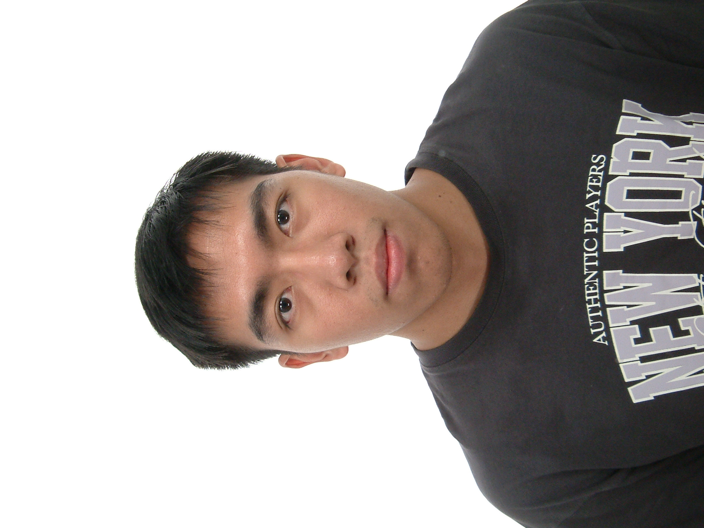
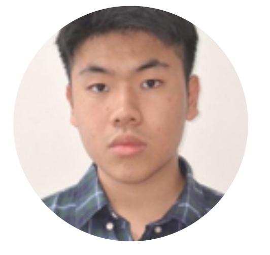
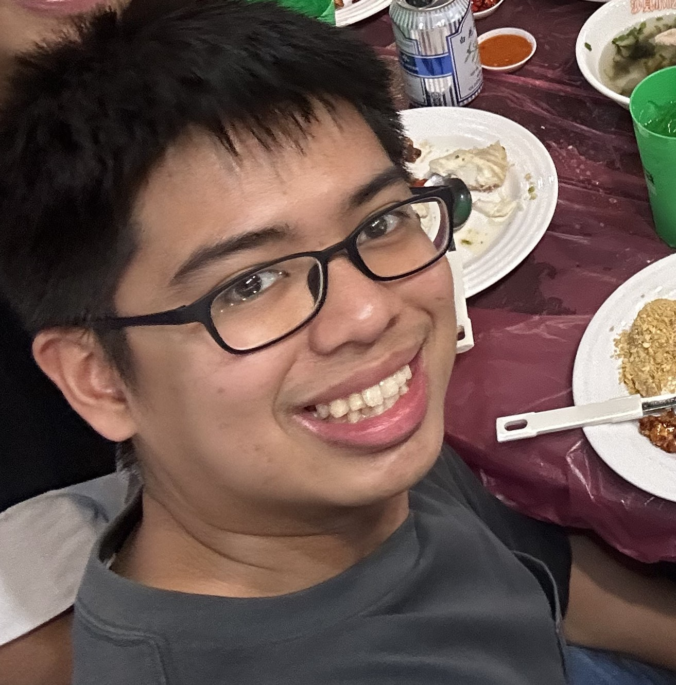

We are a team based in the [School of Computing, National University of Singapore](https://www.comp.nus.edu.sg).

You can reach us at the email `seer[at]comp.nus.edu.sg`

## Project team

### Euan Tan

[[github](https://github.com/euanlt)]

* Role: Project Advisor

### Pranav Jagatheeswaran

[[github](https://github.com/pranavj-960)]

* Role: Team Lead
* Responsibilities: UI

### Stuart

[[github](http://github.com/mr-yeo)] [[portfolio](team/johndoe.md)]

* Role: Developer
* Responsibilities: Data

### Jean Doe

[[github](https://github.com/Vanillajohn)]
[[portfolio](team/johndoe.md)]

* Role: Developer
* Responsibilities: Dev Ops + Threading

### Alfred Chew

[[github](https://github.com/Polar1605)]
[[portfolio](https://www.linkedin.com/in/alfred-chew-23292a267/)]

* Role: Developer
* Responsibilities: UI
